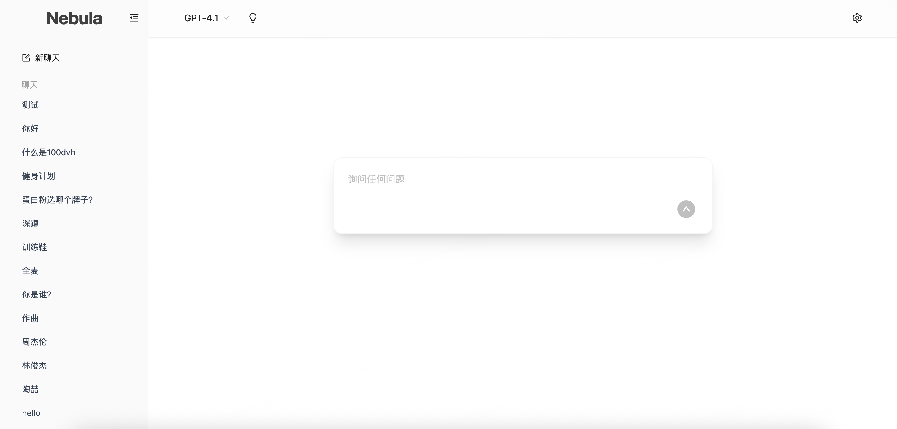

# Nebula

English | [简体中文](#简体中文)

Nebula is a minimalist, elegant third‑party AI Web UI built with Vite, React, and TypeScript. The interface design takes inspiration from ChatGPT, aiming for a clean, modern aesthetic that focuses on usability and speed.



## Tech Stack

- Vite
- React
- TypeScript
- Tailwind CSS

## Features

- Long conversation memory
- Multiple model providers & per‑model configuration
- Streaming responses
- Multi‑session & conversation history
- Message management (edit / rename / delete)
- System prompt support

## Roadmap (Planned)

- Export / import sessions
- Prompt library
- Keyboard shortcut guide
- Theming (light / dark / auto)

## Development

Prerequisites: Node.js 18+ and pnpm installed.

Install deps & start dev server:

```bash
pnpm install
pnpm dev
```

Backend (if `server/` is used) run separately:

```bash
cd server
pnpm install
pnpm start
```

## License

MIT (see future `LICENSE` file if added).

---

## 简体中文

[English](#nebula) | 简体中文

Nebula 是一款**极简且具有质感的第三方 AI Web UI**，使用 Vite、React、TypeScript 构建，界面风格参考 ChatGPT 官网，专注于快速、清爽与可扩展。


## 技术栈

- Vite
- React
- TypeScript
- Tailwind CSS

## 功能特性

- 对话上下文长记忆
- 多模型来源 & 独立配置
- 流式输出
- 多会话与历史记录
- 消息管理（编辑 / 重命名 / 删除）
- 系统提示词支持

## 规划中

- 会话导入 / 导出
- Prompt 模板库
- 快捷键说明
- 主题（亮 / 暗 / 跟随系统）

## 开发

环境需求：Node.js 18+ 且已安装 pnpm。

安装依赖并启动前端开发服务器：

```bash
pnpm install
pnpm dev
```

如果需要使用 `server/` 后端：

```bash
cd server
pnpm install
pnpm start
```

## 许可证

MIT（若后续添加 `LICENSE` 文件）。

---

欢迎提出 Issue / PR 改进项目。🚀
